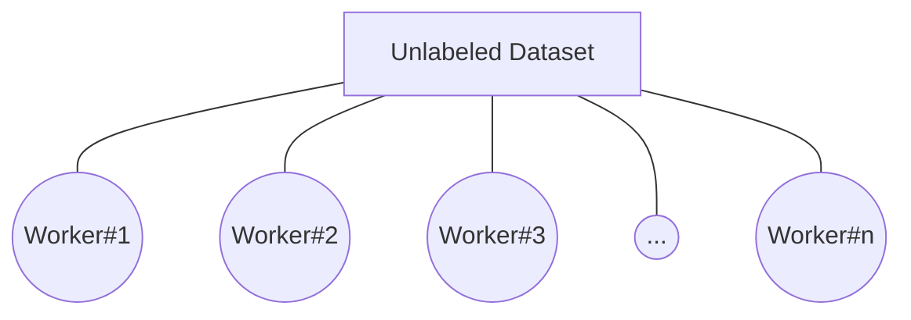

# MeshLabeler
**MeshLabeler** is a tool to help label the unlabeled (*i.e new or self made*) dataset manually over a private network so that together can make the task easier with a friendly UI.

### Objective
Once an enthusiast tried to help the world the he collected some raw data.

But he needed to be labeled this unlabeled the new dataset and wanted the help of his/her well wishers, team members. The job became very painful as they have to collaborate this large dataset by excel sheet.

And then....

But to avoid these anger, annoying etc etc ... [pore likhbo]

...help together in a easy way to make the world better. 

### Supported :

| **Data type** | **File** | **Perform** | **Status**
| Text | csv | Multi-label, Label | Developing
| Image | jpg | Segmentation, Label, Multi-label, Annotation |Not yet
| Video | mp4 | Segmentation, Label, Multi-label |Not yet
| Audio | wav | Segmentation, Label, Multi-label |Not yet

### **Limitation :**

 - Manage only one dataset at a time.
 - Save file will produce a file.
